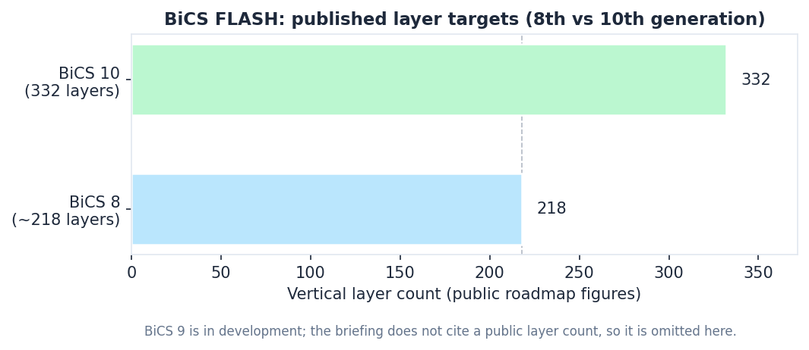
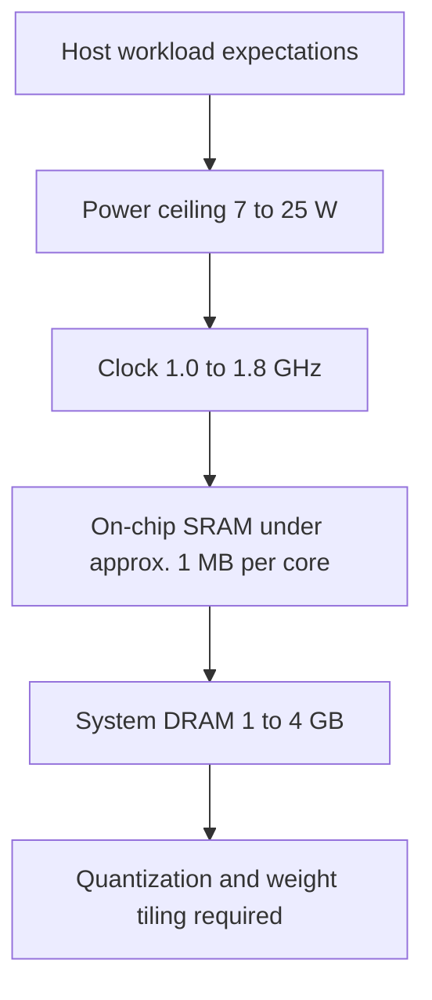
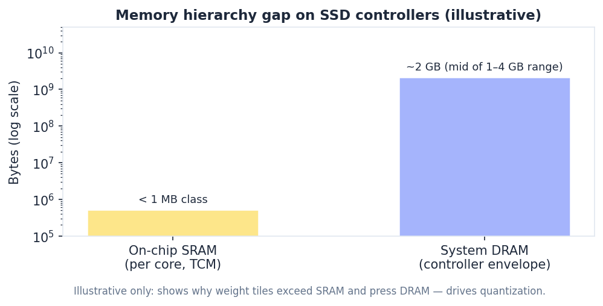
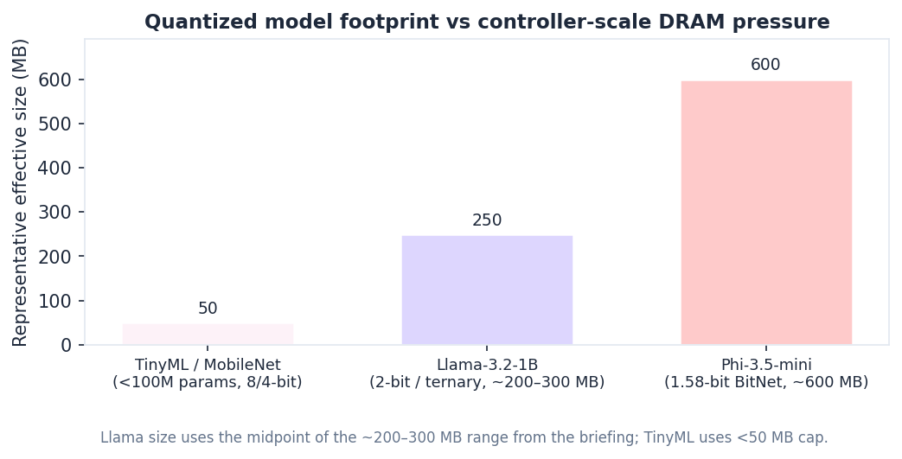

# Strategic Analysis of Embedded Small Language Model Inference on Solid-State Drive Controllers

A structured briefing on computational storage, NAND roadmap alignment, and TinyLM feasibility on SSD controllers.

 

 

[Executive summary](#executive-summary) • [KIOXIA trajectory](#kioxia-technology-trajectory) • [Patents & partnerships](#relevant-patent-landscape-and-rd-focus) • [Competitive landscape](#competitive-landscape-computational-storage) • [Technical feasibility](#technical-feasibility-tinylm-on-ssd-controllers) • [Market signals](#market-signals-and-use-cases) • [Positioning & opportunities](#kioxias-positioning-and-gaps) • [Sources](#sources)

**Diagrams.** [Mermaid](https://mermaid.js.org/) blocks render on GitHub, GitLab, and many static-site generators. Static charts are generated as matching [PNG](figures/) and [SVG](figures/) files via [`scripts/gen_figures.py`](scripts/gen_figures.py) (`pip install -r requirements-figures.txt`).

---

This document reformats the *Computational Storage AI Briefing* into a single reference suitable for technical and strategy audiences. It preserves the original analysis on embedding [Small Language Models (TinyLMs)](https://arxiv.org/html/2603.23668v1) in solid-state drive controllers, the role of [extreme quantization](https://arxiv.org/html/2504.12285v2), and the shift toward [intelligent, queryable storage](https://www.min.io/learn/enterprise) in enterprise environments. For complementary industry context on how flash tiers interact with GPU memory during inference scaling, see coverage of [SSD infrastructure and AI inference](https://siliconangle.com/2026/03/23/ssd-infrastructure-becomes-critical-ai-inference-scales-nvidiagtcai/). Broader [KIOXIA perspectives on AI and storage](https://americas.kioxia.com/en-us/insights.html) are summarized alongside primary citations below.

---

## Executive summary

The transition of the solid-state drive from a passive repository of binary data to an active computational endpoint represents a structural shift in the data center and edge computing hierarchy. As large language models scale toward trillions of parameters, the traditional memory-processor interface is encountering a physical and economic boundary known as the [memory wall](https://www.kioxia.com/en-jp/insights/hbm-ssd-202603.html), where [High Bandwidth Memory (HBM)](https://www.tomshardware.com/tech-industry/artificial-intelligence/samsung-and-sk-hynix-warn-ai-driven-memory-shortages-could-last-until-2027-and-beyond-as-hbm-demand-explodes-customers-already-reserving-supply-years-ahead-while-the-wider-dram-market-begins-to-tighten) capacity cannot keep pace with the data-intensive nature of inference, particularly in Retrieval-Augmented Generation (RAG) and long-context reasoning. Industry analysis positions SSD tiers as increasingly central to inference architectures that must balance latency and capacity ([SiliconANGLE](https://siliconangle.com/2026/03/23/ssd-infrastructure-becomes-critical-ai-inference-scales-nvidiagtcai/)).

This report investigates the feasibility of embedding TinyLMs directly within [KIOXIA](https://www.kioxia.com/en-jp/about/group.html) solid-state drive (SSD) controllers, leveraging the high density of [10th-generation BiCS FLASH](https://www.techpowerup.com/news-tags/Flash+Memory?page=2) and the low latency of [XL-FLASH](https://americas.kioxia.com/en-us/business/memory/xlflash.html) Storage Class Memory (SCM). The analysis identifies that the current technology trajectory is moving toward “Near-Zero DRAM” architectures, where software-defined layers such as [AiSAQ](https://milvus.io/docs/aisaq.md) allow for billion-scale vector searches directly from flash media with minimal memory footprints.

Competitive pressure from integrated computational storage players like [ScaleFlux](https://scaleflux.com/partners/aic-and-scaleflux/), who are adopting [ARM Cortex-R82](https://www.arm.com/products/silicon-ip-cpu/cortex-r/cortex-r82) 64-bit real-time processors ([ScaleFlux announcement](https://scaleflux.com/in-the-media/scaleflux-to-integrate-arm-cortex-r82-processors-in-its-next-generation-enterprise-ssd-controllers/)), necessitates a strategic shift for KIOXIA to integrate dedicated neural processing units (NPUs) or systolic arrays within its controller silicon. Discussions of open, reusable ISA foundations for AI silicon ([Jon Peddie Research](https://www.jonpeddie.com/news/risc-v-becomes-ai-hardwares-open-foundation/)) sit alongside the dominance of licensed cores such as [Cortex-R82](https://developer.arm.com/en/Processors/Cortex-R82) in storage-class devices ([product coverage](https://www.tomshardware.com/news/arm-new-cortexr82-core-targets-advanced-ssds-and-instorage-processing-applications)).

Technical feasibility is anchored by extreme quantization techniques, specifically [1.58-bit ternary models (BitNet)](https://arxiv.org/html/2504.12285v2), which reduce model weights to a scale compatible with the sub-100MB memory constraints of a storage controller. Market signals indicate that privacy, data sovereignty, and the 200x energy efficiency advantage of local storage compute over remote DRAM accesses are driving enterprise demand for intelligent, queryable storage solutions; regulatory and compliance pressures are discussed widely in enterprise AI literature ([example overview](https://www.blackfog.com/5-enterprise-use-cases-ai-privacy-concerns/)).

---

## KIOXIA technology trajectory

KIOXIA’s trajectory is governed by a focus on maximizing bit density while simultaneously engineering the latency out of the memory hierarchy. The evolution from early NAND flash to the current BiCS FLASH 3D architecture has provided the foundational capacity required for modern AI workloads, but the company’s recent focus on Software-Enabled Flash (SEF) and [AiSAQ](https://milvus.io/docs/aisaq.md) signifies a pivot toward intelligent data management. Application-level positioning for [AI workloads on KIOXIA media](https://americas.kioxia.com/en-us/business/application/ai.html) reinforces this direction.

### Evolution of BiCS FLASH and CMOS directly bonded to array

The cornerstone of KIOXIA’s trajectory is the BiCS FLASH 3D technology, which has moved through ten generations of vertical and lateral scaling. The 8th generation marked a significant departure from traditional manufacturing by introducing CMOS directly bonded to array (CBA) technology. This process involves the separate fabrication of the CMOS logic wafer and the memory cell array wafer, which are then bonded together. This allows for the logic layer to be manufactured using more advanced process nodes without being subjected to the thermal cycles required for NAND cell formation, enabling higher interface speeds and more complex logic functions within the drive.

The roadmap for 2026–2027 targets the mass production of 10th-generation BiCS FLASH, which is projected to achieve 332 layers. This represents a 1.5x increase in layer count over the 8th generation, which is essential for storing the massive vector databases associated with generative AI. The integration of CBA technology facilitates interface speeds up to 3.6 Gbps, providing the necessary bandwidth to support on-device AI accelerators. Trade press on [flash memory](https://www.techpowerup.com/news-tags/Flash+Memory?page=2) and archived industry reporting ([TweakTown news archive](https://www.tweaktown.com/news/archive/2023/9/index.html)) illustrates how OEM milestones are communicated alongside roadmap claims.

| Generation | Stacking architecture | Key innovations | Targeted application |
| --- | --- | --- | --- |
| BiCS 8 | ~218 layers | CBA, on-pitch select (OPS) | Enterprise SSDs, 2Tb QLC |
| BiCS 9 | Developing | Enhanced bit density, power efficiency | Data-intensive AI, high-speed interfaces |
| BiCS 10 | 332 layers | Industry-leading layer count | Generative AI training and inference infrastructure |

*Numeric roadmap chart (BiCS 9 is developing without a public layer count in the briefing, so it is omitted). Vector: [bics-layers.svg](figures/bics-layers.svg).*

Controller and firmware intelligence trends intersect with patent analytics and competitive teardowns ([SSD controller technology landscape](https://www.patsnap.com/resources/blog/rd-blog/ssd-controller-technology-landscape-2026-patsnap-eureka/)).

### XL-FLASH and the latency-critical tier

While standard NAND provides capacity, XL-FLASH serves as KIOXIA’s high-performance tier, bridging the gap between DRAM and traditional flash. The architecture uses a unique 16-plane design that addresses word and bit lines in short dimensions, reducing read latency to less than 5 microseconds. The second generation of XL-FLASH, supporting MLC (multi-level cell) functions, is currently in mass production, providing a balance of speed and cost for applications such as high-frequency trading and AI vector search. Technical positioning of [Storage Class Memory with XL-FLASH](https://blog-us.kioxia.com/post/2026/04/30/delivering-optimized-storage-class-memory-with-kioxia-xl-flash-technology) accompanies the [product overview](https://americas.kioxia.com/en-us/business/memory/xlflash.html).

KIOXIA is pushing this tier further with a Super High IOPS SSD project, which demonstrated an emulator capable of delivering over 100 million IOPS. This project, in conjunction with the NVIDIA Storage-Next initiative, aims to allow GPUs to access flash memory directly as an expansion of HBM. Ecosystem reporting ties these themes together ([KIOXIA at NVIDIA GTC 2026](https://americas.kioxia.com/en-us/business/news/2026/ssd-20260312-1.html)). By 2027, KIOXIA intends to reach the 100 million IOPS milestone using PCIe 7.0 interfaces, which would effectively treat storage as a near-memory resource for AI accelerators. Related announcements on [SSDs optimized for GPU-initiated workloads](https://americas.kioxia.com/en-us/business/news/2026/ssd-20260316-1.html) underscore the co-design imperative between GPUs and storage.

### Software-Enabled Flash and intelligent data management

KIOXIA’s position on intelligent storage is heavily influenced by the Software-Enabled Flash (SEF) project, an open-source initiative under the Linux Foundation. SEF allows storage developers to exert direct control over latency, data placement, and workload isolation, effectively removing the “black box” nature of traditional SSD firmware. This is critical for embedding TinyLMs, as the model’s inference tasks can be prioritized and scheduled alongside standard I/O operations to prevent latency spikes. Industry commentary on evolving storage software stacks complements this picture ([J Metz: Storage Short Take](https://jmetz.com/2022/08/storage-short-take-48/)).

| Technology | Project type | Core objective | Status |
| --- | --- | --- | --- |
| SEF | Open source (Linux Foundation) | Host-controlled storage management | Production ready |
| AiSAQ | Open source software | SSD-optimized approximate nearest neighbor search | Integrated into Milvus 2.6.4+ ([docs](https://milvus.io/docs/aisaq.md), [KIOXIA press release](https://americas.kioxia.com/en-us/business/news/2025/ssd-20251216-1.html)) |
| RocksDB plug-in | Software optimization | Minimizing write amplification factor (WAF) | Demonstrated on XD8 Series |

The AiSAQ (All-in-Storage ANNS with Product Quantization) technology represents the most direct link to on-device AI inference. AiSAQ allows billion-scale vector searches to be performed directly from the SSD, bypassing the need to load the entire index into DRAM. KIOXIA has demonstrated scaling to [4.8 billion vectors on a single server](https://americas.kioxia.com/en-us/business/news/2026/ssd-20260316-2.html) ([regional posting](https://europe.kioxia.com/en-europe/business/news/2026/20260316-1.html)), with future targets in the trillion-vector range.

---

## Relevant patent landscape and R&D focus

KIOXIA’s patent portfolio from 2020 to 2025 shows a distinct shift toward reliability intelligence and 3D heterogeneous integration. Analysis from [PatSnap Eureka](https://www.patsnap.com/resources/blog/rd-blog/ssd-controller-technology-landscape-2026-patsnap-eureka/) identifies KIOXIA (formerly Toshiba Memory) as a major assignee in fields such as reconfigurable SSD storage pools and workload-adaptive over-provisioning. These patents suggest that KIOXIA is developing the internal logic required for the SSD to autonomously manage its resources based on the needs of AI workloads.

Key innovation clusters in the last five years include:

- **Predictive failover management:** Per-block failure prediction using on-chip AI to move reliability logic into the firmware layer.
- **3D controller stacking:** Research into heterogeneous integration where the controller logic is stacked directly atop or beneath the memory array, reducing physical trace lengths and power consumption.
- **Content-addressable memory (CAM) NAND:** Patents related to using NAND arrays for direct search operations, mimicking the behavior of associative memories required for AI lookups ([US8780634B2](https://patents.google.com/patent/US8780634B2/en)).

---

## Partnerships and strategic investments

KIOXIA’s primary partnership remains the joint venture with SanDisk Corporation (now part of Western Digital), [extended through 2034](https://www.kioxia.com/en-jp/about/news/2026/20260130-1.html). This collaboration provides the economies of scale necessary for R&D in the Yokkaichi and Kitakami plants, which accounts for approximately 29% of the world’s flash memory production capacity according to [group disclosures](https://www.kioxia-holdings.com/content/dam/kioxia-hd/en-jp/ir/library/integrated-report/2025/asset/Integrated-Report-2025-all-view-en.pdf) and supporting sections on [management and capital](https://www.kioxia-holdings.com/content/dam/kioxia-hd/en-jp/ir/library/integrated-report/2025/asset/Integrated-Report-2025-04-en.pdf).

Furthermore, KIOXIA’s collaboration with NVIDIA on the cuVS library and Storage-Next initiatives signals a deep integration into the enterprise AI ecosystem, positioning KIOXIA SSDs as a fundamental tier in the NVIDIA-led AI data center architecture ([GTC 2026 presence](https://americas.kioxia.com/en-us/business/news/2026/ssd-20260312-1.html)). Trade reporting continues to contrast DRAM-centric vendors with NAND-centric suppliers in AI build-outs ([EEWORLD commentary](https://en.eeworld.com.cn/news/manufacture/eic717137.html)).

---

## Competitive landscape: computational storage

The computational storage market is undergoing a transition from niche academic curiosity to a structural component of AI infrastructure, with a projected market size of $4.30 billion by 2032 ([MarketsandMarkets report listing](https://www.marketsandmarkets.com/Market-Reports/computational-storage-market-71343109.html), [press summary](https://www.prnewswire.com/news-releases/computational-storage-market-worth-4-30-billion-by-2032---exclusive-report-by-marketsandmarkets-302689302.html)). Related forecasts for storage software and hybrid architectures appear in market research channels ([storage software forecast](https://www.fortunebusinessinsights.com/storage-software-market-110255), [enterprise hybrid storage analysis](https://www.futuremarketinsights.com/reports/enterprise-class-hybrid-storage-market)).

The competitive field is split between established memory giants and agile startups focusing on specialized controllers.

### Major players and public progress

Samsung and ScaleFlux are currently leading the market in terms of product footprint and market share. Samsung’s SmartSSD remains a pivotal product, integrating an FPGA-based processor for in-storage analytics and AI inference. However, there is a clear industry trend toward ASIC-based solutions to maximize power efficiency. [HBM supply dynamics](https://www.tomshardware.com/tech-industry/artificial-intelligence/samsung-and-sk-hynix-warn-ai-driven-memory-shortages-could-last-until-2027-and-beyond-as-hbm-demand-explodes-customers-already-reserving-supply-years-ahead-while-the-wider-dram-market-begins-to-tighten) remain a backdrop for any storage-centric AI strategy.

| Competitor | Primary AI or compute direction | Recent developments |
| --- | --- | --- |
| Samsung | FPGA-based SmartSSDs and HBM dominance | Acquisition of SanDisk patents to bolster SmartSSD efficiency; focus on HBM shortages persisting through 2027 |
| ScaleFlux | ASIC-based CSDs with transparent compute | Adoption of ARM Cortex-R82 for next-gen AI storage ([press](https://scaleflux.com/in-the-media/scaleflux-to-integrate-arm-cortex-r82-processors-in-its-next-generation-enterprise-ssd-controllers/)); [CSD5000 series](https://scaleflux.com/in-the-media/scaleflux-reveals-the-revolutionary-csd5000-for-the-ai-era/) sampling ([product narrative](https://scaleflux.com/blog/csd5000-a-paradigm-shift-in-nvme-ssds-for-ai-and-data-center-infrastructure/)); [AI and GPU-focused solutions](https://scaleflux.com/solutions/artificial-intelligence-ai-machine-learning-and-inferencing-keeping-the-gpus-productive/); [inference outlook](https://scaleflux.com/storage/prepping-for-the-future-demands-of-ai-inference-reasoning-part-2/); ecosystem partnerships ([AIC and ScaleFlux](https://scaleflux.com/partners/aic-and-scaleflux/)) |
| SK Hynix | Processing-in-memory (AiM) and HBM4 | Focus on HBM market leadership to address GPU memory bottlenecks |
| Micron | HBM3e and CXL memory expansion | Leveraging CXL protocols for pooled memory; strong HBM and DRAM exposure |
| ScaleFlux (controllers) | Computational storage controllers | Demonstration of 14 GB/s throughput with integrated compression engines |

### Startups and intelligent storage solutions

A new wave of startups is addressing the inefficiencies of traditional block storage for AI:

- **ScaleFlux:** While expanding rapidly, they remain a primary innovator in hardware-native write reduction and transparent compression, claiming 3x performance-per-watt over traditional KIOXIA and Samsung drives ([AI workload framing](https://scaleflux.com/solutions/artificial-intelligence-ai-machine-learning-and-inferencing-keeping-the-gpus-productive/)).
- **Nyriad:** Specializing in GPU-accelerated storage and high-availability systems for big data workloads.
- **Eideticom:** Developers of the NoLoad computational storage platform, which offloads intensive tasks to NVM-based accelerators.
- **Phison:** Emerging as a strong competitor in high-end controllers (for example, SM2508), targeting low power (7W) and high sequential performance (14 GB/s) for mobile AI applications.

### Existing products for ML inference at the controller

The most prominent existing products in this domain include the Samsung SmartSSD and the ScaleFlux CSD series. ScaleFlux’s CSD5000 series, powered by the FX5016 controller, integrates inline data compression and metadata management to reduce host CPU overhead during AI training and inference ([CSD5000 launch coverage](https://scaleflux.com/in-the-media/scaleflux-reveals-the-revolutionary-csd5000-for-the-ai-era/)). In contrast, KIOXIA has focused on the software layer via AiSAQ, which leverages standard enterprise SSDs (like the CM9 series) rather than a bespoke computational controller, though this software allows for AI-native search functions that mimic dedicated computational storage behavior.

---

## Technical feasibility: TinyLM on SSD controllers

Embedding Small Language Models (TinyLMs) on an SSD controller requires navigating extreme constraints in terms of silicon area, power consumption, and thermal management. The feasibility is enabled by the convergence of 64-bit real-time processors and extreme model compression, described comprehensively in surveys spanning [TinyML through LLMs](https://arxiv.org/html/2603.23668v1).

### Hardware constraints of modern SSD controllers

SSD controllers are architected for deterministic performance and reliability, not general-purpose high-performance computing. They operate in a tightly regulated thermal environment, often without active cooling in client form factors.

| Hardware metric | Typical enterprise SSD controller constraint | Technical impact on TinyLM |
| --- | --- | --- |
| Processor type | 32-bit or 64-bit real-time (for example, [ARM Cortex-R82](https://www.arm.com/products/silicon-ip-cpu/cortex-r/cortex-r82)) | R82 provides 64-bit addressing for greater than 4GB RAM but requires an MMU for Linux and AI stacks ([developer documentation](https://developer.arm.com/en/Processors/Cortex-R82)) |
| Clock frequency | 1.0 GHz to 1.8 GHz | Significantly lower than host CPUs; limits tokens per second to low single digits |
| On-chip SRAM | Less than 1 MB per core (tightly coupled memory) | Insufficient for even small model weight tiles; requires constant swapping |
| System DRAM | 1 GB to 4 GB (internal or host-mapped) | Primary bottleneck for weight storage; requires aggressive quantization |
| Power budget | 7 W (mobile) to 25 W (enterprise) | Limits sustained high-throughput neural processing |

**Constraint stack (conceptual).** The flowchart summarizes how on-controller limits compound for TinyLM hosting (qualitative order, not a literal firmware pipeline).

*Contrasts on-chip SRAM class vs a mid-range point in the 1–4 GB controller DRAM envelope. [memory-hierarchy-log.svg](figures/memory-hierarchy-log.svg).*

The ARM Cortex-R82 is the first realistic candidate for hosting TinyLMs. It offers an MMU to run rich operating systems like Linux, which is necessary for hosting AI frameworks, while maintaining real-time deterministic control for storage tasks. The processor’s Neon SIMD technology can be utilized to accelerate matrix-vector multiplications, the core operation of transformer inference ([historical launch analysis](https://www.tomshardware.com/news/arm-new-cortexr82-core-targets-advanced-ssds-and-instorage-processing-applications)).

### State of the art in quantized inference

To fit a language model into the sub-100MB memory footprint typical of a controller’s available buffer, quantization must reach the 1-bit or 2-bit level.

- **BitNet b1.58 (ternary quantization):** This paradigm maps weights to values of \{-1, 0, 1\}. It reduces the memory required for weights by orders of magnitude and replaces expensive floating-point multiplications with simple additions and subtractions ([technical report](https://arxiv.org/html/2504.12285v2); [discussion thread](https://www.reddit.com/r/LocalLLaMA/comments/1rybdkv/mathematics_behind_extreme_quantization_of/)).
- **GGUF and llama.cpp:** These formats are optimized for CPU-based inference and allow for the offloading of model components between different storage tiers. Studies on Meta’s Llama 3.2 3B model show a 68.66% reduction in size using 4-bit quantization, enabling mobile execution ([quantization for mobile execution](https://arxiv.org/html/2512.06490v1)).
- **TQ1_0 and TQ2_0:** Specialized packing methods for ternary values. TQ1_0 (5 trits in 8 bits) is highly memory-efficient, while TQ2_0 is optimized for computer memory boundaries to provide faster inference.

[Inference on ultra-low-power edge devices](https://pmc.ncbi.nlm.nih.gov/articles/PMC9227753/) frames how TinyML techniques intersect with storage-class silicon.

### Viable model architectures and memory footprints

For an SSD controller, the following model scales and architectures are technically viable if combined with aggressive quantization:

| Model architecture | Parameter count | Quantization | Effective size | Latency and performance |
| --- | --- | --- | --- | --- |
| Llama-3.2-1B | 1 billion | 2-bit or ternary | ~200 MB to 300 MB | Acceptable for offline indexing |
| Phi-3.5-mini | 3.8 billion | 1.58-bit (BitNet) | ~600 MB | Requires 1GB+ controller DRAM |
| TinyML or MobileNet | Less than 100 million | 8-bit or 4-bit | Less than 50 MB | Real-time; limited reasoning |

*Llama uses the midpoint of the ~200–300 MB range from the table; TinyML capped at 50 MB. [model-footprint-mb.svg](figures/model-footprint-mb.svg).*

Natural language queries on a storage controller would likely target a 1B parameter model at 2-bit precision. While inference might be slow (approximately 0.5 to 1 token per second), it is sufficient for background metadata generation, document summarization, and semantic tagging of stored files.

### “In-storage processing” in industry and academia

The academic and industry focus has shifted from simple computational storage toward CXL-driven memory expansion.

- **SolidAttention:** A project that offloads the key-value (KV) cache of LLMs to the SSD, reducing the DRAM footprint by up to 98%. This allows for extremely long context windows (128k+ tokens) on memory-constrained devices ([USENIX FAST paper](https://www.usenix.org/system/files/fast26-zheng.pdf)).
- **ExPAND:** A CXL-based ML prefetcher that uses machine learning on the SSD controller to predict host CPU memory access patterns, reducing latency by 9.0x to 14.7x ([arXiv preprint](https://arxiv.org/pdf/2505.18577)).
- **oLLM:** A lightweight library that streams model components dynamically between GPU VRAM, system RAM, and SSD, bypassing VRAM limitations ([Medium article](https://sodevelopment.medium.com/run-massive-ai-models-on-tiny-hardware-with-ollm-ab8e3140acd7)).

---

## Market signals and use cases

The demand for intelligent, queryable storage is driven by the explosive growth of unstructured data and the high cost of centralized AI processing. Market research indicates a clear shift toward tiered storage and AI-enhanced management platforms, including projections for [storage-as-a-service](https://www.researchandmarkets.com/reports/6232382/storage-service-staas-market-strategic) and regional analyst summaries ([strategic insights, Traditional Chinese market report listing](https://www.gii.tw/report/ksi1995836-storage-service-staas-market-strategic-insights.html)).

### Enterprise use cases for queryable storage

Enterprise leaders are increasingly focused on extracting value from core business data without moving it into expensive, centralized data lakes. Representative enterprise AI patterns appear across vendor literature ([enterprise intelligence](https://www.infor.com/blog/enterprise-intelligence-ai-clean-connected-data), [enterprise AI use cases](https://www.nice.com/enterprise-ai-platform/enterprise-ai-use-cases)).

- **Legal discovery and compliance:** Searching millions of documents for semantic intent rather than keywords. AI-powered agents can interact directly with cloud file systems ([enterprise data and AI patterns on Google Cloud](https://www.databricks.com/blog/google-cloud-use-cases)) or local SSDs to summarize documents and draft responses.
- **Healthcare records:** Using TinyML for real-time analysis of activity data and clinical records locally to preserve patient privacy.
- **Financial audit trails:** Identifying anomalies in massive transactional logs at the storage layer, reducing the burden on central servers.
- **Distributed cyber-resilience:** SSDs that use AI to detect ransomware patterns in I/O streams or network traffic before data is compromised.

Privacy and security challenges for enterprise AI deployments are surveyed in dedicated security analyses ([AI privacy concerns](https://www.blackfog.com/5-enterprise-use-cases-ai-privacy-concerns/)).

### Privacy and sovereignty drivers

Privacy and security are the top challenges for 44% of IT leaders surveyed. On-device storage intelligence is preferred over cloud-based indexing for several reasons:

- **Data leakage prevention:** Organizations do not want to send proprietary data to public LLMs just for inference.
- **Compliance:** Regulations like GDPR and HIPAA require strict controls on data movement. Local processing ensures user data remains at the source.
- **Offline functionality:** Enabling AI intelligence in environments with limited or no internet access (for example, edge, space, or secured facilities).

### Adjacent products and market trends

The “AI PC” era is driving the integration of AI functions directly into standard laptops and smartphones, which in turn increases the demand for high-capacity, high-performance flash memory. Consumer electronics showcases illustrate packaging of memory and SSD roadmaps alongside AI messaging ([KIOXIA at CES 2026](https://blog-us.kioxia.com/post/2026/02/04/next-gen-memory-ssd-and-ai-solutions-from-kioxia-shine-at-ces-2026)).

- **AI-powered desktop search:** Gemini and Copilot-like agents that need local vector databases to function efficiently.
- **STaaS (storage-as-a-service):** Projected to reach $41.2 billion by 2031, with AI-enhanced management and automated tiering as key differentiators ([regional market listing](https://www.gii.tw/report/ksi1995836-storage-service-staas-market-strategic-insights.html), [global market research listing](https://www.researchandmarkets.com/reports/6232382/storage-service-staas-market-strategic)).
- **Hybrid storage architectures:** The cost differential between all-flash and HDD architectures sustains demand for tiered systems that use AI for intelligent data movement.

---

## KIOXIA’s positioning and gaps

KIOXIA is currently in a state of rapid growth driven by the AI supercycle; market commentary has highlighted strengthening demand for AI-related storage ([Techzine Global](https://www.techzine.eu/news/infrastructure/137565/kioxia-benefits-from-growing-demand-for-ai-storage/)). However, the company faces critical strategic gaps in the hardware-software integration required for on-device AI. Group-level narratives on value creation are documented in the [Integrated Report 2025 materials](https://www.kioxia-holdings.com/content/dam/kioxia-hd/en-jp/ir/library/integrated-report/2025/asset/Integrated-Report-2025-03-en.pdf), while [corporate profile PDFs](https://www.kioxia-holdings.com/content/dam/kioxia-hd/en-jp/about/asset/kioxia-holdings-corporate-profile-e.pdf) summarize structural facts used throughout this briefing.

### Strengths and vulnerabilities

**Strengths:**

- **BiCS FLASH density:** The ability to produce 332-layer NAND provides a cost and capacity advantage for massive vector databases.
- **XL-FLASH latency:** The deterministic performance of SCM is a key enabler for the “Near-GPU” cache tier, reducing the reliance on expensive HBM ([XL-FLASH overview](https://americas.kioxia.com/en-us/business/memory/xlflash.html), [SCM technology blog](https://blog-us.kioxia.com/post/2026/04/30/delivering-optimized-storage-class-memory-with-kioxia-xl-flash-technology)).
- **Open-source software leadership:** Initiatives like AiSAQ and SEF have established KIOXIA as a software innovator in the storage stack ([Milvus integration news](https://americas.kioxia.com/en-us/business/news/2025/ssd-20251216-1.html)).
- **Manufacturing scale:** A 29% world share in production bits ensures that KIOXIA can move the market by adopting new standards ([Integrated Report 2025](https://www.kioxia-holdings.com/content/dam/kioxia-hd/en-jp/ir/library/integrated-report/2025/asset/Integrated-Report-2025-all-view-en.pdf)).

**Vulnerabilities:**

- **Lack of dedicated AI controller IP:** While ScaleFlux and Samsung have bespoke computational controllers, KIOXIA relies on standard controllers with software offloads.
- **No HBM portfolio:** Competitors like Samsung and SK Hynix benefit from the HBM boom, while KIOXIA is vulnerable to the cannibalization of storage budgets by memory spend ([market tension reporting](https://en.eeworld.com.cn/news/manufacture/eic717137.html)).
- **Regional R&D concentration:** Most R&D is localized in Japan (Yokohama, Yokkaichi) and the US, with limited research presence in emerging European hubs. Global sales structure is summarized on the [global sales offices page](https://www.kioxia.com/en-jp/business/buy/global-sales.html).

### Strategic gaps for on-device AI

1. **Hardware-level tensor acceleration:** KIOXIA must move beyond software ANNS and integrate dedicated tensor cores or systolic arrays into its controller ASIC to compete with the 3x performance-per-watt advantage of computational storage specialists.
2. **Integrated KV-cache management:** Developing firmware that natively manages KV-cache offloading (similar to SolidAttention) would make KIOXIA the preferred vendor for the AI PC market ([SolidAttention](https://www.usenix.org/system/files/fast26-zheng.pdf)).
3. **End-to-end RAG systems:** While AiSAQ is a strong component, KIOXIA lacks a unified hardware-software appliance that competes with integrated NVIDIA and ScaleFlux storage targets ([GPU workload SSD announcement](https://americas.kioxia.com/en-us/business/news/2026/ssd-20260316-1.html)).

---

## Key decision-makers in KIOXIA R&D

Leadership in technology development is concentrated in the Frontier Technology R&D Institute and the SSD Division. Organizational context appears in [group company listings](https://www.kioxia.com/en-jp/about/group.html) and corporate disclosures ([corporate profile PDF](https://www.kioxia-holdings.com/content/dam/kioxia-hd/en-jp/about/asset/kioxia-holdings-corporate-profile-e.pdf)).

| Name | Role | Location | Key area of influence |
| --- | --- | --- | --- |
| Hideshi Miyajima | Managing Executive Officer, CTO | Japan | Overall technology roadmap and BiCS strategy |
| Masashi Yokotsuka | Managing Executive Officer, VP SSD Division | Japan | Productization of AI-ready storage and AiSAQ |
| Atsushi Inoue | Executive Officer, VP Memory Division | Japan | Flash memory technology innovation and industry keynotes |
| Neville Ichhaporia | SVP and GM, SSD Business Unit | USA | US-based SSD strategy and NVIDIA and OCP collaboration |
| Masafumi Takahashi | Senior Fellow, Frontier Tech R&D Institute | Japan | Research into AI data center storage architecture |
| Rory Bolt | Senior Fellow and Principal Architect | USA | Primary architect for AiSAQ, SEF, and FDP |
| Gili Buzaglo | Director, Software R&D | Israel | Software development for intelligent storage |

---

## European and Greece-adjacent presence

KIOXIA Europe GmbH is headquartered in Düsseldorf, Germany, focusing primarily on sales and marketing ([regional offices overview](https://www.kioxia.com/en-jp/business/buy/global-sales.html)).

- **Research presence:** KIOXIA Israel Ltd. serves as a key overseas R&D site for software and controller techniques.
- **Regional collaboration potential:** No dedicated KIOXIA R&D center exists in Greece or Eastern Europe. However, the region is seeing a surge in AI research. The University of Nicosia (UNIC Athens) has partnered with Purdue University for a “living lab” in the Ellinikon smart city project, focusing on AI and data science ([Kathimerini coverage](https://knews.kathimerini.com.cy/en/news/unic-athens-positioned-as-bridge-between-europe-and-the-u-s), [Purdue newsroom](https://www.purdue.edu/newsroom/2026/Q1/purdue-partners-with-university-of-nicosia-athens-to-advance-research-collaboration-and-online-learning-in-europe/)). Greece’s National Recovery and Resilience Plan “Greece 2.0” is establishing innovation centers for digital skills and AI, presenting opportunities for academic-industrial collaboration ([Eurydice network news](https://eurydice.eacea.ec.europa.eu/news/greece-new-innovation-centres-boost-digital-skills-and-stem-education-alignment-eu-priorities)).

---

## Strategic gaps and actionable opportunities

The analysis reveals four critical opportunities where on-device AI for storage can address KIOXIA’s current vulnerabilities.

### 1. Hardening AiSAQ into the SSD controller silicon

KIOXIA has successfully proven the software-based vector search model through AiSAQ ([open repository](https://github.com/kioxia-jp/aisaq-diskann)). The next logical step is to integrate the Product Quantization (PQ) and graph traversal logic into a dedicated hardware block within the next-generation controller ASIC. This would provide a “Search-on-Drive” feature that is significantly faster than the current software-over-NVMe implementation, targeting the 100 million IOPS performance tier.

### 2. The “Privacy-in-Box” personal storage tier

There is a major opportunity for a client SSD line specifically branded for privacy-conscious AI PC users. By embedding a 1B-parameter BitNet model within a 4TB BG-series SSD, KIOXIA could offer “Self-Indexing” storage that summarizes and tags personal files locally without any OS-level tracking or cloud uploading. This addresses top concerns of IT leaders regarding data leakage while leveraging KIOXIA’s leadership in compact form factor (2230) SSDs.

### 3. CXL-based memory pooling for RAG infrastructure

The demand for massive memory expansion is currently unmet by DRAM alone. KIOXIA should accelerate its CXL 3.0 controller development to create “XL-Flash Expanders.” These devices would present themselves as high-capacity, tiered memory to the host CPU or GPU, using AI-driven prefetching (as seen in the [ExPAND project](https://arxiv.org/pdf/2505.18577)) to mask flash latency. This would allow KIOXIA to capture a portion of the high-margin HBM market by offering a “Memory Expansion as a Service” product.

### 4. Establishing a Mediterranean R&D hub for edge AI

To tap into the European AI research ecosystem and address the lack of Eastern European presence, KIOXIA should consider a collaboration or satellite office in Athens, Greece. The Ellinikon smart city and related university initiatives are designed to bridge US and European innovation ([UNIC Athens bridge narrative](https://knews.kathimerini.com.cy/en/news/unic-athens-positioned-as-bridge-between-europe-and-the-u-s), [Purdue partnership](https://www.purdue.edu/newsroom/2026/Q1/purdue-partners-with-university-of-nicosia-athens-to-advance-research-collaboration-and-online-learning-in-europe/)). Partnering on health and robotics pilots would allow KIOXIA to pilot intelligent storage solutions in a living-lab environment while accessing EU recovery funding channels referenced in [European education policy updates](https://eurydice.eacea.ec.europa.eu/news/greece-new-innovation-centres-boost-digital-skills-and-stem-education-alignment-eu-priorities).

---

## Conclusion of strategic assessment

KIOXIA is currently at an inflection point. The company’s mastery of NAND physics and bit density provides a temporary shield, but the rise of computational storage competitors who are integrating AI-native processing like the ARM R82 indicates that the industry is moving toward “Intelligent Memory.” By transitioning from the current software-led AI approach (AiSAQ) to a hardware-integrated TinyLM strategy, KIOXIA can maintain its 29% market share and redefine the SSD as the cognitive center of the modern data stack. Macro reporting on [AI-era NAND demand](https://www.techzine.eu/news/infrastructure/137565/kioxia-benefits-from-growing-demand-for-ai-storage/) and co-evolution of [HBM and SSD roles](https://www.kioxia.com/en-jp/insights/hbm-ssd-202603.html) supports viewing storage as a first-class citizen in inference scaling, not only a capacity tier.

---

## Sources

The following list preserves the briefing’s reference set. Every item appears inline above as a hyperlink at least once.

1. [A New Era in AI Storage Pioneered by the Coexistence of HBM and SSDs – Unpacking Kioxia Strategy](https://www.kioxia.com/en-jp/insights/hbm-ssd-202603.html)  
2. [SSD infrastructure becomes critical as AI inference scales – SiliconANGLE](https://siliconangle.com/2026/03/23/ssd-infrastructure-becomes-critical-ai-inference-scales-nvidiagtcai/)  
3. [SolidAttention: Low-Latency SSD-based Serving on Memory-Constrained PCs – USENIX](https://www.usenix.org/system/files/fast26-zheng.pdf)  
4. [KIOXIA achieves 4.8 billion high-dimensional vector search database on a single server, with 7.8x index build time acceleration via GPUs (Americas)](https://americas.kioxia.com/en-us/business/news/2026/ssd-20260316-2.html)  
5. [AiSAQ – Milvus documentation](https://milvus.io/docs/aisaq.md)  
6. [Cortex-R82 – Arm product page](https://www.arm.com/products/silicon-ip-cpu/cortex-r/cortex-r82)  
7. [ScaleFlux to integrate Arm Cortex-R82 processors in its next-generation enterprise SSD controllers](https://scaleflux.com/in-the-media/scaleflux-to-integrate-arm-cortex-r82-processors-in-its-next-generation-enterprise-ssd-controllers/)  
8. [RISC-V becomes AI hardware’s open foundation – Jon Peddie Research](https://www.jonpeddie.com/news/risc-v-becomes-ai-hardwares-open-foundation/)  
9. [BitNet b1.58 2B4T technical report – arXiv](https://arxiv.org/html/2504.12285v2)  
10. [TinyML: enabling inference deep learning models on ultra-low-power IoT edge devices – PMC](https://pmc.ncbi.nlm.nih.gov/articles/PMC9227753/)  
11. [Enterprise object storage in the AI age – MinIO](https://www.min.io/learn/enterprise)  
12. [Energy-efficient software–hardware co-design for machine learning: from TinyML to large language models – arXiv](https://arxiv.org/html/2603.23668v1)  
13. [儲存即服務 (STaaS) 市場：策略洞察與預測 (2026–2031) – GII](https://www.gii.tw/report/ksi1995836-storage-service-staas-market-strategic-insights.html)  
14. [AI applications – KIOXIA United States](https://americas.kioxia.com/en-us/business/application/ai.html)  
15. [News posts matching “Flash Memory” – TechPowerUp](https://www.techpowerup.com/news-tags/Flash+Memory?page=2)  
16. [Next-gen memory, SSD and AI solutions from Kioxia shine at CES 2026 – KIOXIA blog](https://blog-us.kioxia.com/post/2026/02/04/next-gen-memory-ssd-and-ai-solutions-from-kioxia-shine-at-ces-2026)  
17. [XL-FLASH Storage Class Memory – KIOXIA United States](https://americas.kioxia.com/en-us/business/memory/xlflash.html)  
18. [KIOXIA accelerates AI innovation with high-performance memory and SSD solutions at NVIDIA GTC 2026](https://americas.kioxia.com/en-us/business/news/2026/ssd-20260312-1.html)  
19. [KIOXIA announces new SSD model optimized for AI GPU-initiated workloads](https://americas.kioxia.com/en-us/business/news/2026/ssd-20260316-1.html)  
20. [News archive – September 2023 – TweakTown](https://www.tweaktown.com/news/archive/2023/9/index.html)  
21. [Storage Short Take #48 – J Metz’s blog](https://jmetz.com/2022/08/storage-short-take-48/)  
22. [kioxia-jp/aisaq-diskann – GitHub](https://github.com/kioxia-jp/aisaq-diskann)  
23. [KIOXIA achieves 4.8 billion high-dimensional vector search database on a single server (Europe)](https://europe.kioxia.com/en-europe/business/news/2026/20260316-1.html)  
24. [SSD controller technology landscape 2026 – PatSnap Eureka](https://www.patsnap.com/resources/blog/rd-blog/ssd-controller-technology-landscape-2026-patsnap-eureka/)  
25. [US8780634B2 – CAM NAND with OR function and full chip search capability – Google Patents](https://patents.google.com/patent/US8780634B2/en)  
26. [Kioxia and Sandisk extend Yokkaichi joint venture agreement through 2034](https://www.kioxia.com/en-jp/about/news/2026/20260130-1.html)  
27. [Integrated Report 2025 (full PDF)](https://www.kioxia-holdings.com/content/dam/kioxia-hd/en-jp/ir/library/integrated-report/2025/asset/Integrated-Report-2025-all-view-en.pdf)  
28. [Integrated Report 2025 – Management and capital (PDF)](https://www.kioxia-holdings.com/content/dam/kioxia-hd/en-jp/ir/library/integrated-report/2025/asset/Integrated-Report-2025-04-en.pdf)  
29. [Computational storage market report – MarketsandMarkets listing](https://www.marketsandmarkets.com/Market-Reports/computational-storage-market-71343109.html)  
30. [Computational storage market worth $4.30 billion by 2032 – MarketsandMarkets via PR Newswire](https://www.prnewswire.com/news-releases/computational-storage-market-worth-4-30-billion-by-2032---exclusive-report-by-marketsandmarkets-302689302.html)  
31. [ScaleFlux reveals the revolutionary CSD5000 for the AI era](https://scaleflux.com/in-the-media/scaleflux-reveals-the-revolutionary-csd5000-for-the-ai-era/)  
32. [Artificial intelligence: machine learning and inferencing – keeping the GPUs productive – ScaleFlux](https://scaleflux.com/solutions/artificial-intelligence-ai-machine-learning-and-inferencing-keeping-the-gpus-productive/)  
33. [CSD5000: a paradigm shift in NVMe SSDs for AI and data center infrastructure – ScaleFlux](https://scaleflux.com/blog/csd5000-a-paradigm-shift-in-nvme-ssds-for-ai-and-data-center-infrastructure/)  
34. [Prepping for the future demands of AI inference reasoning: part 2 – ScaleFlux](https://scaleflux.com/storage/prepping-for-the-future-demands-of-ai-inference-reasoning-part-2/)  
35. [KIOXIA AiSAQ technology integrated into Milvus vector database](https://americas.kioxia.com/en-us/business/news/2025/ssd-20251216-1.html)  
36. [Cortex-R82 product support – Arm Developer](https://developer.arm.com/en/Processors/Cortex-R82)  
37. [Arm’s new Cortex-R82 core targets advanced SSDs and in-storage processing applications – Tom’s Hardware](https://www.tomshardware.com/news/arm-new-cortexr82-core-targets-advanced-ssds-and-instorage-processing-applications)  
38. [Mathematics behind extreme quantization of Microsoft’s BitNet – Reddit r/LocalLLaMA](https://www.reddit.com/r/LocalLLaMA/comments/1rybdkv/mathematics_behind_extreme_quantization_of/)  
39. [Optimizing LLMs using quantization for mobile execution – arXiv](https://arxiv.org/html/2512.06490v1)  
40. [Run massive AI models on tiny hardware with oLLM – Medium](https://sodevelopment.medium.com/run-massive-ai-models-on-tiny-hardware-with-ollm-ab8e3140acd7)  
41. [CXL topology-aware and expander-driven prefetching: unlocking SSD performance – arXiv](https://arxiv.org/pdf/2505.18577)  
42. [Storage software market size and forecast – Fortune Business Insights](https://www.fortunebusinessinsights.com/storage-software-market-110255)  
43. [Enterprise-class hybrid storage market – Future Market Insights](https://www.futuremarketinsights.com/reports/enterprise-class-hybrid-storage-market)  
44. [Drive enterprise intelligence with AI and connected data – Infor](https://www.infor.com/blog/enterprise-intelligence-ai-clean-connected-data)  
45. [Google Cloud use cases: how enterprises run data and AI on GCP with Databricks – Databricks](https://www.databricks.com/blog/google-cloud-use-cases)  
46. [Top enterprise AI use cases – NiCE](https://www.nice.com/enterprise-ai-platform/enterprise-ai-use-cases)  
47. [Five enterprise use cases where AI privacy concerns must be addressed – BlackFog](https://www.blackfog.com/5-enterprise-use-cases-ai-privacy-concerns/)  
48. [KIOXIA insights – United States](https://americas.kioxia.com/en-us/insights.html)  
49. [Integrated Report 2025 – Kioxia Group value creation initiatives (PDF)](https://www.kioxia-holdings.com/content/dam/kioxia-hd/en-jp/ir/library/integrated-report/2025/asset/Integrated-Report-2025-03-en.pdf)  
50. [Storage as a Service (STaaS) market – Research and Markets listing](https://www.researchandmarkets.com/reports/6232382/storage-service-staas-market-strategic)  
51. [Kioxia benefits from growing demand for AI storage – Techzine Global](https://www.techzine.eu/news/infrastructure/137565/kioxia-benefits-from-growing-demand-for-ai-storage/)  
52. [Global sales offices – KIOXIA](https://www.kioxia.com/en-jp/business/buy/global-sales.html)  
53. [Samsung and SK hynix warn AI-driven memory shortages could last until 2027 and beyond – Tom’s Hardware](https://www.tomshardware.com/tech-industry/artificial-intelligence/samsung-and-sk-hynix-warn-ai-driven-memory-shortages-could-last-until-2027-and-beyond-as-hbm-demand-explodes-customers-already-reserving-supply-years-ahead-while-the-wider-dram-market-begins-to-tighten)  
54. [Samsung, SK Hynix, and Micron versus Kioxia in AI data centers – EEWORLD](https://en.eeworld.com.cn/news/manufacture/eic717137.html)  
55. [AIC and ScaleFlux – ScaleFlux partners](https://scaleflux.com/partners/aic-and-scaleflux/)  
56. [Group companies – KIOXIA](https://www.kioxia.com/en-jp/about/group.html)  
57. [Corporate profile – KIOXIA Holdings (PDF)](https://www.kioxia-holdings.com/content/dam/kioxia-hd/en-jp/about/asset/kioxia-holdings-corporate-profile-e.pdf)  
58. [UNIC Athens positioned as bridge between Europe and the US – KNEWS](https://knews.kathimerini.com.cy/en/news/unic-athens-positioned-as-bridge-between-europe-and-the-u-s)  
59. [Purdue partners with University of Nicosia–Athens – Purdue University newsroom](https://www.purdue.edu/newsroom/2026/Q1/purdue-partners-with-university-of-nicosia-athens-to-advance-research-collaboration-and-online-learning-in-europe/)  
60. [Greece: new innovation centres to boost digital skills and STEM education – Eurydice Network](https://eurydice.eacea.ec.europa.eu/news/greece-new-innovation-centres-boost-digital-skills-and-stem-education-alignment-eu-priorities)  
61. [Delivering optimized Storage Class Memory with KIOXIA XL-FLASH technology – KIOXIA blog](https://blog-us.kioxia.com/post/2026/04/30/delivering-optimized-storage-class-memory-with-kioxia-xl-flash-technology)  

---

This briefing is a **living landscape analysis**: it tracks a fast-moving intersection of storage, silicon, and AI, and is **not** presented as a finished product, vendor specification, or static snapshot. The authors maintain it as part of **active work** in computational storage and adjacent inference architectures. Expect updates as roadmaps, papers, and markets shift.

If you operate in this space, **contributions are welcome**: sharper citations, factual corrections, missing benchmarks or products, and pointers to primary sources all help keep the analysis honest and useful. Product and trademark names cited herein belong to their respective owners.
